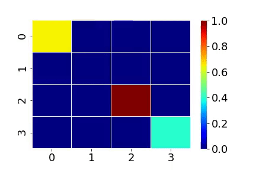

# AgentAssistance

 

Reinforcement learning Q Learning  Grid-World 8 directions.
Change number of grids, position of trap, goal in the gridworld.py
The Qtable_gridworld.ipynb is in raw unrefined stage, will upload a clean code in nearfuture. 
Simulated weighted assistance vs game score 

Here three different weights simulations results are shown,  
Assist As Needed = Competence 1.0 + Autonomy .75

Assist As Needed = Competence 1.0 + Autonomy 1.0

Assist As Needed = Competence 0.75 + Autonomy 1.0

